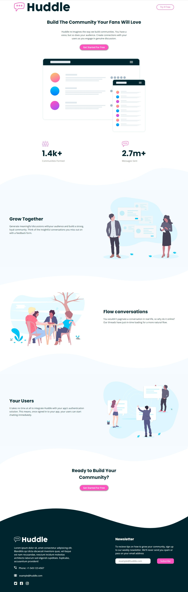

# Frontend Mentor - Huddle landing page with curved sections solution

This is a solution to the [Huddle landing page with curved sections challenge on Frontend Mentor](https://www.frontendmentor.io/challenges/huddle-landing-page-with-curved-sections-5ca5ecd01e82137ec91a50f2). Frontend Mentor challenges help you improve your coding skills by building realistic projects.

## Table of contents

- [Overview](#overview)
  - [The challenge](#the-challenge)
  - [Screenshot](#screenshot)
  - [Links](#links)
- [My process](#my-process)
  - [Built with](#built-with)
  - [What I learned](#what-i-learned)

## Overview

### The challenge

Users should be able to:

- View the optimal layout for the site depending on their device's screen size
- See hover states for all interactive elements on the page

### Screenshot

### Links

- Solution URL: [Solution code](https://github.com/ifeoluwah21/huddle-landing-page)
- Live Site URL: [Live site](https://ifeoluwah21.github.io/huddle-landing-page/)

## My process

### Built with

- Semantic HTML5 markup
- SCSS custom properties
- Flexbox

### What I learned

I learnt about positioning the curved edges in some sections.

## Author

- Frontend Mentor - [@ifeoluwah21](https://www.frontendmentor.io/profile/ifeoluwah21)
- Twitter - [@\_ifeoluwaaa](https://twitter.com/_ifeoluwaaa)
